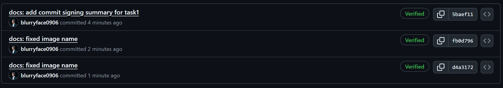

# Лабораторная работа 1 — Подпись коммитов и шаблон PR

## Task 1 — SSH Commit Signature Verification

### 1. Краткое объяснение преимуществ подписанных коммитов

Подписанные коммиты позволяют однозначно подтвердить, что автором изменения является конкретный разработчик, а не кто‑то посторонний, кто знает его имя/email.  
Также подпись защищает от подмены истории: если кто‑то попытается изменить коммит или его автора, подпись станет недействительной, и это будет заметно в системе контроля версий.  
Ещё, в командной работе подписанные коммиты повышают уровень доверия и прозрачности: ревьюеры видят значок **Verified** и понимают, что изменения пришли из доверенного источника.

### 2. Доказательство успешной настройки SSH‑ключа и подписанного коммита
Скриншот привязанного в git SSH-ключа для подписи коммитов

Скриншот подписанных коммитов с verified меткой на GitHub

Этот значок подтверждает, что GitHub распознал подпись коммита, ассоциировал её с моим аккаунтом и считает коммит проверенным.

### 3. Почему подпись коммитов важна в DevOps‑воркфлоу?

Подпись коммитов помогает гарантировать, что код, который отправляется в этом коммите, действительно был создан и одобрен известными участниками команды.  
Это снижает риск внедрения вредоносных изменений: если неизвестный пользователь попытается внести правку без корректной подписи, такие коммиты можно автоматически блокировать или помечать как недоверенные.  
Кроме того, в бигтехах часто следят за изменениями. Подписанные коммиты упрощают отслеживание того, кто и когда внёс конкретное изменение. Это важно для безопасности и разборов инцидентов.

---